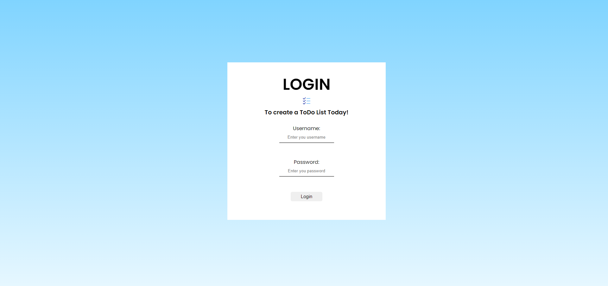
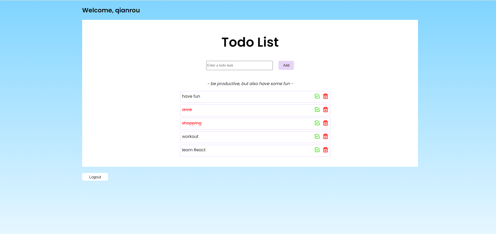

# Todo List

This is a simple React todo list that requires user log in to add and checked their todos. 



In this app implementation, I have create a admin user & password, username: qianrou and password: admin. Which only allow the admin user for this project. 



Once the user is logged in, it will list all the todos that the user has created, if there are any existing todos that has been stored in the local Storage.

# Description 
This application allows the user to log in to store and keep track on its todos. Each todos will contain two buttons such as the checked button and the remove button. Once the user is done, they can log out. 

# How to install the application
## You can either download file or clone it
## Step to download
Download 'code' button from my github page
### To start the application
```
$ npm start
```


## Step to clone the repository in the terminal
```
$ git clone https://github.com/qianrou-13/qr-react-todolist.git
```
### To install packaging
```
$ npm install
```
### To start the application
```
$ npm start
```


# Propose upgrade version in the future
* Improve better security checking for user details.
* Allows more than one user login at the same time.  